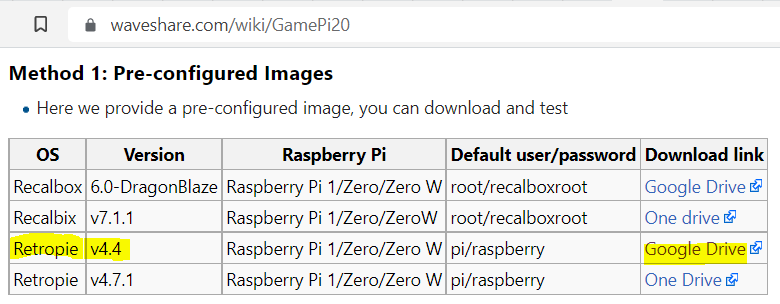

# gamepi20
Notes and instructions to build GamePi20 w/RetroPie (for intermediate users)

#### Quick Start

* UPDATE:  I tested the RetroPie v4.7.1 image on Raspberry Pi 0 W and 0 2.  It works on both.  This image file also works on Raspberry Pi Zero 2 + 1.3" ST7789 LCD HAT.

* Check the [Releases](https://github.com/p4wnsolo/p4nwsolo-gamepi20/releases) tab for Gamepi20 RetroPie [v4.7.1 (recommended)](https://github.com/p4wnsolo/p4nwsolo-gamepi20/releases/tag/retropie_gamepi20_v471) and [v4.4](https://github.com/p4wnsolo/p4nwsolo-gamepi20/releases/tag/retropie_gamepi20) disk image zip files.

*UPDATE:*  I uploaded a copy of Waveshare's GamePi20-customized-RetroPie-v4.4 disk image file to the <a href="https://github.com/p4wnsolo/p4nwsolo-gamepi20/releases/tag/retropie_gamepi20">Releases</a> tab.  It's a ".7z" file.  So, if Waveshare's Google Drive link goes down, you should be able to download the .7z file from the Releases tab of this repo.

+ Plus:  (Totally optional) hardware mod (Bonus - not required - replace Audio Jack with WiFi Antenna - for advanced users only)

## Photos of the Build Process
I took photos of pretty much every step mentioned below.
Just look in the /images folder in this repo (p4wnsolo/gamepi20).

Or see the bottom of this page.

## Tips for Building GamePi20
* For more advanced users:  Use the "Connect GamePi to WiFi" section toward the bottom of this page *before* you flash your SD card (by adding a "wpa_supplicant" text file to the SD card after flashing, so GamePi connects to your WiFi network (this could save you time later)
* Most importantly, make sure you get the display working BEFORE you put the unit into the case.  Why?  Once everything's assembled, it takes just as long to disassemble it and get the display working.  Trust me - get the display working before you put the unit into the case</li>
* Put high heat electrical tape on the back of Raspberry Pi - where the 20 GPIO pins are soldered (explained below)</li>
* I had to replace the metal stand-offs given in this kit - if you have trouble booting GamePi while inside its own metal case, this is likely the issue (explained below).  Solve this issue with $2 in screws and a trip to the hardware store.</li>
&nbsp;
## How to Build GamePi20
#### Important Note:  
The 4 "stock" metal stand-offs provided in this kit seem to cause some short/grounding issue, so I _had_ to replace these standoffs with four M2.5x10mm panhead screws (available at a hardware store like ACE in the "mini screws" / computer screws section).   

Since these screws are long enough to eliminate the four tiny mini-screws in the kit as well, I went ahead and left the mini screws out of the final build.   

The M2.5x10mm panhead screws are the perfect length to eliminate the stand-offs _and_ the mini-screws that screw into them.  

So I wouldn't expect GamePi20 to boot up when fully assembled - until you replace the stand-offs with something that won't cause a ground / shorting issue (such as M2.5x10mm screws).   

As long as you leave the stand-offs out of the picture (and put a strip of electrical tape on the back of the Pi, as mentioned in one of the steps below), GamePi20 should boot up.   

Even if you don't have some screws to replace the stand-offs yet, you can - and SHOULD - still do MOST of the set-up process!

The hardest part of this whole process is getting GamePi20 to work while it's inside the metal case, which you can do without the M2.5x10mm replacement screws.  

So just follow the steps bellow to get GamePi20 booted up outside the metal case.

Then by the time you get your M2.5x10mm screws, you just put GamePie in the case, pop the GamePi20 faceplate & screws in, and you're ready to rock.

The first part of this process is downloading the pre-built GamePi20 RetroPie image.  

### Getting Started
So here's what the screen looks like when you go to download the RetroPie disk image made just for GamePi20 (before you get to Step 1 below): 

 

Just make sure you use that disk image highlighted in yellow (RetroPie 4.4).  It definitely works on Raspberry Pi Zero W.  I haven't tested any of the others yet.

## How to Build GamePi20 (Step-by-step)
Follow these steps to build GamePi20 with RetroPie:
  
1.  Start by flashing the RetroPie v4.4 SD Card Image File found here (see screenshot above):  [https://www.waveshare.com/wiki/GamePi20](https://www.waveshare.com/wiki/GamePi20)
2.  (Note: There's a RetroPie v4.7 link at the URL above which is presumably better than v4.4, but the link is a dead Google Drive link)
3.  After you flash the SD card, put it in your GamePi 20
4.  Then attach your Raspberry Pi Zero W(H) to the GamePi20 "unit" using the GPIO pins on your Raspberry Pi Zero WH
5.  Now, add a strip of high-heat electrical tape to the back of Raspberry Pi, where the pins are soldered on the back.  There should be roughly 20 or so solder points (2x10) on the back of the Pi that should be insulated.  Otherwise, these points will contact the metal case and cause GamePi20 to shut off right after it tries to boot the OS.
6.  Plug GamePi20 into power and switch it ON
7.  Wait up to 2 minutes for the display to show something (it usually takes about 30 to 60 seconds)
8.  If Pi shows "RetroPie" and then shows a game system (like Amiga) menu, you're golden - continue to the next step.  If not, try re-flashing the SD card and make sure the GamePi20 unit is OUT of the case (thus eliminating unnecessary electrical ground issues as a possible point of failure)
9.  Once Pi has successfully booted, shut it down.
10.  Then do ONLY the very next step of the build process (see next step).  Take it slow - otherwise you build the whole thing at once, it doesn't boot up, you tear it apart 5 or 6 times, etc.  Just do it right the first time, trust me.
11.  Ok - with your Pi shut down, put the GamePi20 unit into the metal case.  Then power it ON, wait for it to boot up to RetroPie fully, and then process to the next step of the build process.  If RetroPie does _not_ fully boot, then there's probably some part of the GamePi unit touching the metal case.  If that's the situation, then put high heat electrical tape wherever you think it's contacting.  Then put the unit in the case and try to boot up the RetroPie display again.
12.  Once GamePi20 is booting successfully while placed fully inside the metal case, move on the to the next step.
13.  Now remove the 2 tiny screws on both sides of the "gamepad" parts of the GamePi20 unit.  In total, there are 4 tiny screws: 2 screws for each gray gamepad "circle".  Attach the gray gamepad "circles" where you removed the 4 tiny screws.  Now the backing for your buttons is firmly in place.
14.  Now put the buttons on the button pads you just screwed in.  Don't worry about getting them perfect just yet.
15.  Then put the faceplate on.  Tip:  If one or two of the buttons is out of place when putting the face plate on, you can press the button and "pull" it into the right place.
16.  Now put the four M2.5x10mm screws into the four screw holes in the face plate.
17.  Finish screwing them in and power ON your GamePi20.
18.  If GamePi20 boots up, you should be good to go!  Other than that, there's the L and R button, which should be able to snap in even after GamePi is fully assembled.

## To get GamePi20 Connected to WiFi:

*   Take the SD card out of GamePi20 (yes - you need to completely take it out of the case and un-build it)
*   Put the SD card into a computer
*   Follow [steps to add "wpa_supplicant.conf" and "ssh" file from Raspberry-Pi-Spy](https://www.raspberrypi-spy.co.uk/2017/04/manually-setting-up-pi-wifi-using-wpa_supplicant-conf/)
*   But start with Step 2 at the link above
*   Then put your SD card back in GamePi - but don't put GamePi back in the case til you're sure WiFi is good to go
*   Now use Angry IP Scanner on your PC (run as Administrator after installed), use it to scan your network, and then copy "RETROPIE"'s IP address to your SSH app, press Connect, then run the command "ping -c2 google.com" to make sure your GamePi is connected to the Internet!

## Transfer Games (ROMs) to GamePi20

*   Use the steps above to get GamePi connected to WiFi
*   Then use CyberDuck or another SFTP app to connect to your GamePi (on PORT 22!)
*   Now just navigate to the "RetroPie/roms" folder in CyberDuck on your GamePi
*   Then go into a folder like "snes" (for SNES games)
*   Finally just drag and drop your SNES roms into the Cyber Duck screen to have it send the ROMs from your PC to your GamePi
*   Don't forget to change folders for different game consoles (ex:  "nes" folder for NES games vs SNES games folder)

*   To find ROMs, try Google

## How to Replace Audio Jack with WiFi Antenna

*   Requirements
    *   Raspberry Pi Zero WH + WiFi antenna jack soldered onto the RPi

1.  Clip out the audio jack (I used the clippers that came with my soldering kit)
2.  Use a 1/4" drill bit to 1) widen the audio jack hole that's in the metal case, and 2) make the audio jack hole about 1/4" lower than where it currently is (this is important)Once you clip the audio jack out completely and widen + extend the audio jack hole in the metal case, there's enough room for your WiFi Antenna &amp; fitting inside the case.

If you don't make the audio jack hole go lower than where it is "stock", your screen won't be low enough, it will bow, could break, looks terrible, makes the charging port inaccessible, power button inaccessible, and other atrocities.

The fix is to make the audio jack hole about 1/4" deeper than where it currently is.

This way you can move the WiFi antenna fitting to be lower in the metal case than where it would be if you <em>just</em> widened the hole.

&nbsp;

Once the audio jack hole in the metal case is widened + deepened, you can attach the WiFi antenna to the metal case using the nut &amp; washer that should be on it.

## Images

## Resources / Links

These are extra links for getting the display to work without the RetroPie disk image.

https://github.com/cskau/Python_ST7735
https://github.com/pimoroni/st7789-python
https://github.com/freitas-renato/ST7789-RGB
https://github.com/Infineon/display-tft-st7789v
https://github.com/darrenliew96/gamepi20_drivers

## Notes for RPi 0 2

* Write the image to SD card
* Add [`ssh` file & `wpa_supplicant.conf`](https://www.raspberrypi-spy.co.uk/2017/04/manually-setting-up-pi-wifi-using-wpa_supplicant-conf/)
* Add a WiFi dongle
* Boot up and connect via SSH
* Do the steps in the section `5）Install driver for josytic` at [Waveshare wiki](https://www.waveshare.com/wiki/GamePi20)
  * Note: This will get the buttons on the gamepad to work - but they won't be mapped properly (try the L and R buttons for "GO" / "A" button)
* Then run `apt-get update --allow-releaseinfo-change` (from [Proxmox forum](https://forum.proxmox.com/threads/apt-get-update-error-changed-its-suite-value-from-stable-to-oldstable.94726/post-411789))
* Now run `sudo apt-get update`
* Then run `sudo apt-get upgrade`
  * You should see `Preparing to unpack .../136-raspberrypi-kernel-headers_1%3a1.20211201~buster-1_a`
  * ..and `Unpacking raspberrypi-kernel-headers (1:1.20211201~buster-1) over (1.20201022-1)`
  
